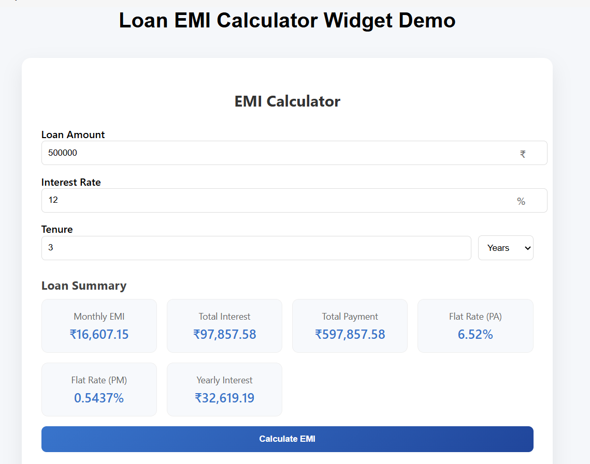
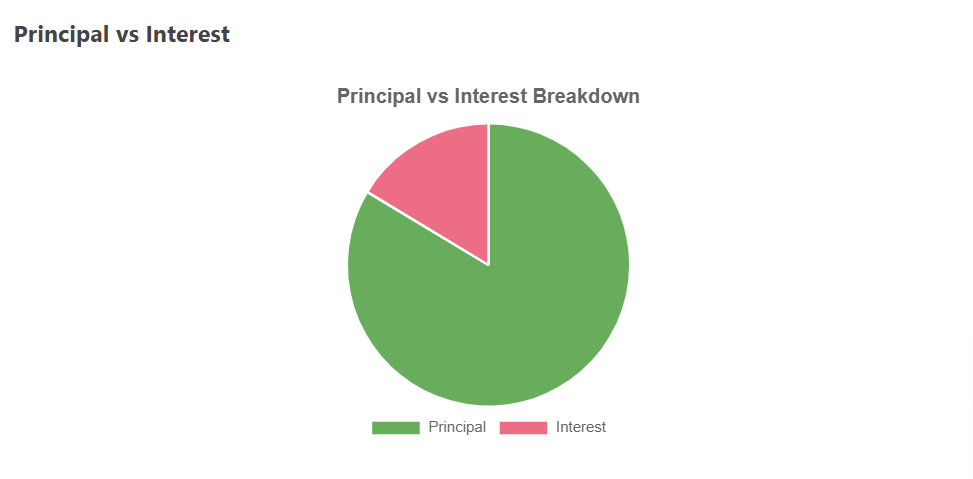
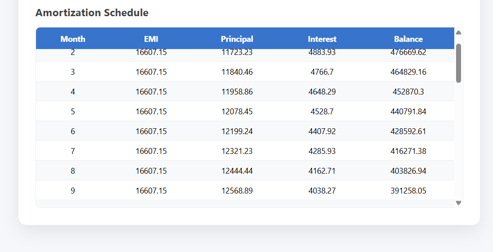

# EMI Calculator Widget

A reusable **EMI Calculator Widget** that calculates loan EMI, visualizes principal vs interest, and generates a complete amortization schedule.

The widget can be embedded into any webpage using a simple script.

---

## Live Demo

Frontend Demo  
https://monis-iqbal-io.github.io/emi-calculator-widget/

Backend API  
https://emi-calculator-api-kn60.onrender.com

API Documentation  
https://emi-calculator-api-kn60.onrender.com/docs

---

## Features

- EMI calculation using standard financial formula
- Loan summary metrics
- Principal vs Interest chart visualization
- Dynamic amortization schedule generation
- Flat interest rate calculations
- Responsive UI for mobile and desktop
- Reusable embeddable JavaScript widget

---

## Screenshots

### Calculator Interface



### Chart Visualization



### Amortization Schedule



---

## Tech Stack

### Frontend
- JavaScript
- HTML
- CSS
- Chart.js

### Backend
- Python
- FastAPI
- Uvicorn

### Deployment
- Render (Backend)
- GitHub Pages (Frontend)

---

## Project Structure

```
emi-calculator-widget
│
├── backend
│   ├── main.py
│   ├── models.py
│   └── emi_service.py
│
├── screenshots
│   ├── calculator.png
│   ├── chart.png
│   └── schedule.png
│
├── emi-calculator.js
├── index.html
│
├── requirements.txt
└── README.md
```

---

## EMI Calculation Formula

The EMI is calculated using the formula:

EMI = P × r × (1 + r)^n / ((1 + r)^n − 1)

Where:

- **P** = Loan Amount  
- **r** = Monthly Interest Rate  
- **n** = Loan Tenure in Months  

---

## API Endpoint

POST `/api/calculate-emi`

### Example Request

```json
{
  "loan_amount": 500000,
  "interest_rate": 12,
  "tenure": 36
}
```

### Example Response

```json
{
 "emi":16607,
 "total_payment":597852,
 "total_interest":97852,
 "flat_rate_pa":6.52,
 "flat_rate_pm":0.54,
 "yearly_interest":32617,
 "schedule":[...]
}
```

---

## How to Run Locally

### Clone Repository

```
git clone https://github.com/monis-iqbal-io/emi-calculator-widget.git
```

### Install Dependencies

```
pip install -r requirements.txt
```

### Start Backend Server

```
uvicorn backend.main:app --reload
```

### Open Demo Page

Open `index.html` in your browser.

---

## Embedding the Widget

To embed the calculator on any webpage:

```html
<div id="emi-calculator"></div>

<script src="https://cdn.jsdelivr.net/npm/chart.js"></script>
<script src="emi-calculator.js"></script>
```

---

## Deliverables

This project includes:

- EMI Calculator frontend component
- JavaScript widget for embedding
- EMI calculation logic
- Chart implementation for principal vs interest
- Dynamic amortization schedule generation
- Example HTML page demonstrating embed usage
- Setup and run instructions

---

## Author

**Monis Iqbal**

Mathematics Major | Computer Science Minor  
Cluster University Srinagar

GitHub  
https://github.com/monis-iqbal-io
